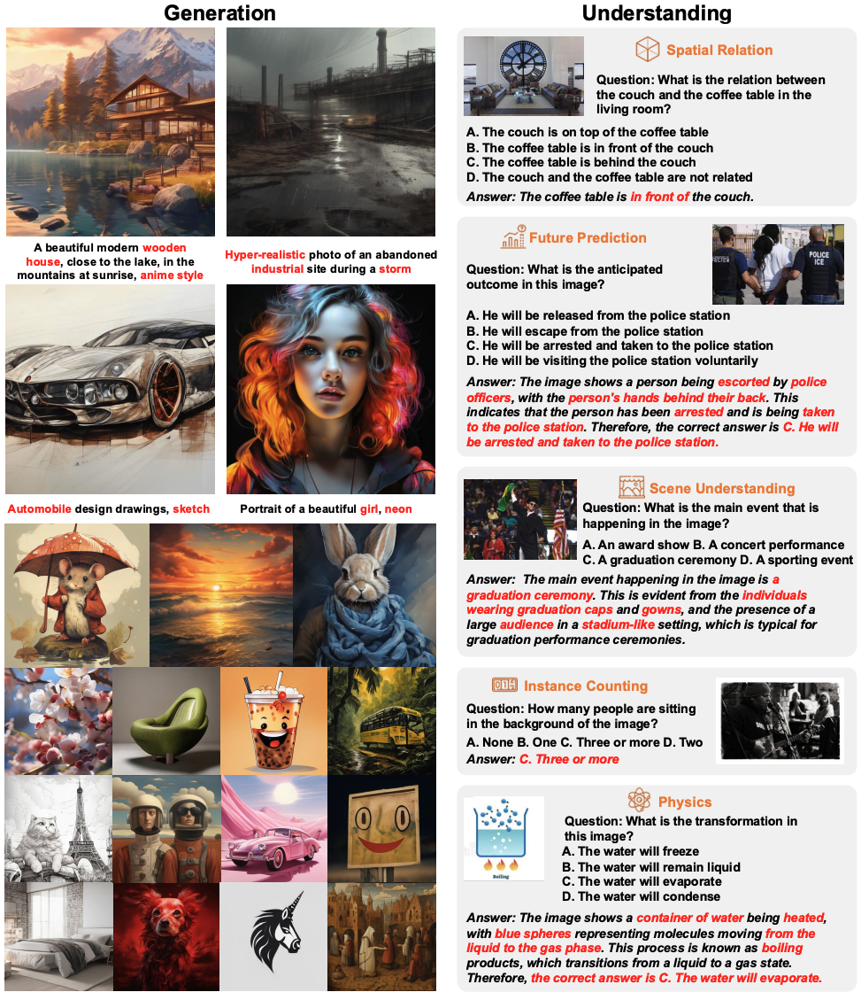
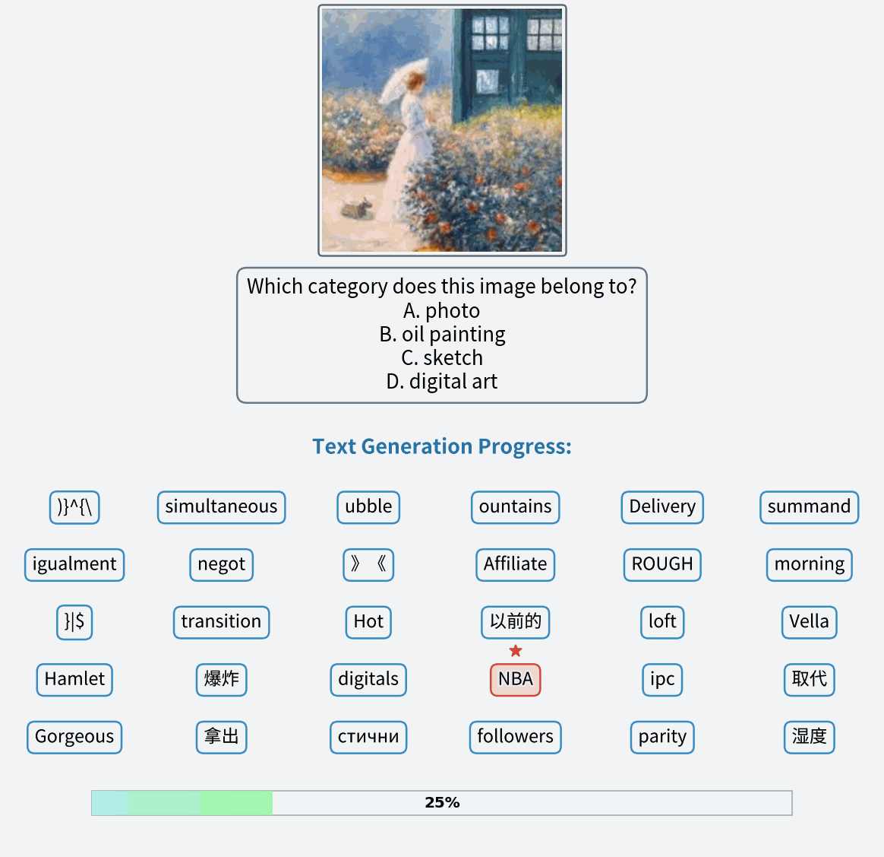

<!-- markdownlint-disable first-line-h1 -->

<!-- markdownlint-disable html -->

<!-- markdownlint-disable no-duplicate-header -->

# FUDOKI: A Unified Multimodal Model Purely Based on Discrete Flow Matching

<p align="left">
  <!-- <a href="#🚀-quick-start"><b>Quick Start</b></a> | -->
  <a href="https://fudoki-hku.github.io/"><b>HomePage</b></a> |
  <a href="https://arxiv.org/abs/2505.20147"><b>arXiv</b></a> |
  <a href="https://huggingface.co/LucasJinWang/FUDOKI"><b>Model</b></a> |
  <!-- <a href="#🖊️-citation"><b>Citation</b></a> <br> -->
</p>

This repository is the official implementation of [FUDOKI: Discrete Flow-based Unified Understanding and Generation via Kinetic-Optimal Velocities](https://arxiv.org/abs/2505.20147).`</h1>`

> [FUDOKI: Discrete Flow-based Unified Understanding and Generation via Kinetic-Optimal Velocities](https://arxiv.org/abs/2505.20147)
> Jin Wang`<sup>`\*`</sup>`, Yao Lai`<sup>`\*`</sup>`, Aoxue Li, Shifeng Zhang, Jiacheng Sun,Ning Kang, Chengyue Wu, Zhenguo Li`<sup>`†`</sup>`, Ping Luo`<sup>`†`</sup>`
> `<sup>`\*`</sup>` JW and YL contribute equally (`<a href="mailto:wj0529@connect.hku.hk">`wj0529@connect.hku.hk`</a>`,
> `<a href="mailto:ylai@connect.hku.hk">`ylai@connect.hku.hk`</a>`).

> `<sup>`†`</sup>` Zhenguo Li and Ping Luo are corresponding authors (`<a href="mailto:zhenguol@gmail.com">`zhenguol@gmail.com`</a>`,
> `<a href="mailto:pluo@cs.hku.hk">`pluo@cs.hku.hk`</a>`).

## News

**2025.07.16**: Release our model and inference demo.

**2025.05.26**: Release our technical report and project page.

## 1. Introduction

The rapid progress of large language models (LLMs) has catalyzed the emergence of multimodal large language models (MLLMs) that unify visual understanding and image generation within a single framework. However, most existing MLLMs rely on autoregressive (AR) architectures, which impose inherent limitations on future development, such as the raster-scan order in image generation and restricted reasoning abilities in causal context modeling. In this work, we challenge the dominance of AR-based approaches by introducing **FUDOKI**, a unified multimodal model purely based on discrete flow matching, as an alternative to conventional AR paradigms. By leveraging metric-induced probability paths with kinetic optimal velocities, our framework goes beyond the previous masking-based corruption process, enabling iterative refinement with self-correction capability and richer bidirectional context integration during generation. To mitigate the high cost of training from scratch, we initialize FUDOKI from pre-trained AR-based MLLMs and adaptively transition to the discrete flow matching paradigm. Experimental results show that FUDOKI achieves performance comparable to state-of-the-art AR-based MLLMs across both visual understanding and image generation tasks, highlighting its potential as a foundation for next-generation unified multimodal models. Furthermore, we show that applying test-time scaling techniques to FUDOKI yields significant performance gains, further underscoring its promise for future enhancement through reinforcement learning.

<table>
  <tr>
    <td width="25%"></td>
    <td width="30%"></td>
    <td width="29%"></td>
  </tr>
</table>

## 2. Model Download

We release FUDOKI to the public to support a broader and more diverse range of research within the academic community.

### Huggingface

| Model  | Download                                                   |
| ------ | ---------------------------------------------------------- |
| FUDOKI | [🤗 Hugging Face](https://huggingface.co/LucasJinWang/FUDOKI) |

## 3. Quick Start

### Installation

On the basis of `Python >= 3.9` environment, install the necessary dependencies by running the following command:

```shell
pip install -r requirements.txt
```

### Simple Inference Example

#### Multimodal Understanding

```
sh scripts/inference_i2t.sh
```

#### Text-to-Image Generation

```
sh scripts/inference_t2i.sh
```

#### Benchmark Evaluations

For evaluating benchmarks on visual understanding, we mainly modify the codebase of [VLMEvalKit](https://github.com/open-compass/VLMEvalKit). Before performing the evaluations, please indicate the CKPT_PATH in VLMEvalKit/run_local.sh and OPENAI_API_KEY/OPENAI_API_BASE in VLMEvalKit/.env.

```
cd VLMEvalKit
bash run_local.sh
```

## 3. Acknowledgement

We expressed sincerely gratitude for the projects listed following:

- [Flow Matching](https://github.com/facebookresearch/flow_matching) provides useful implements for discrete flow matching.
- [Janus-Series](https://github.com/deepseek-ai/Janus) provides useful implements for unified multimodal understanding and generation.
- [LlamaGen](https://github.com/FoundationVision/LlamaGen) provides helpful implements for visual tokenization.

Thanks for their selfless dedication.

## 4. Citation

```bibtex
@article{wang2025fudokidiscreteflowbasedunified,
    title={FUDOKI: Discrete Flow-based Unified Understanding and Generation via Kinetic-Optimal Velocities}, 
    author={Jin Wang and Yao Lai and Aoxue Li and Shifeng Zhang and Jiacheng Sun and Ning Kang and Chengyue Wu and Zhenguo Li and Ping Luo},
    year={2025},
    eprint={2505.20147},
    archivePrefix={arXiv},
    primaryClass={cs.CV},
    url={https://arxiv.org/abs/2505.20147}
}
```
